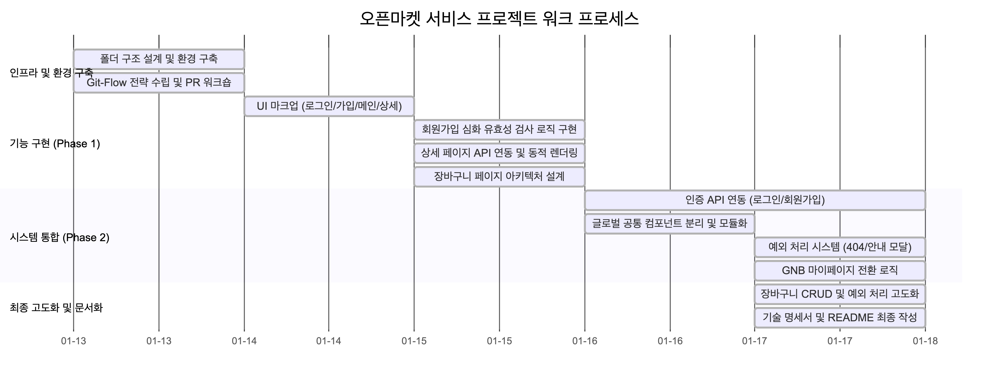
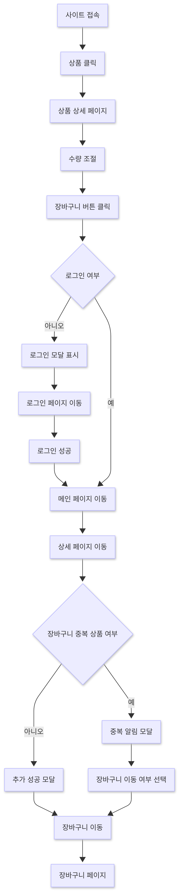
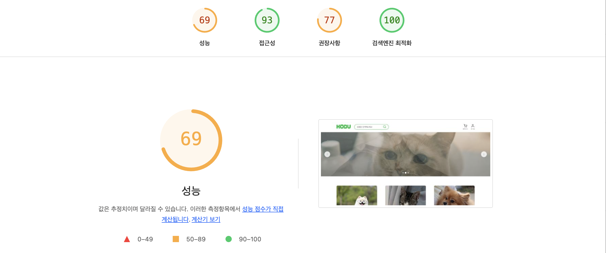
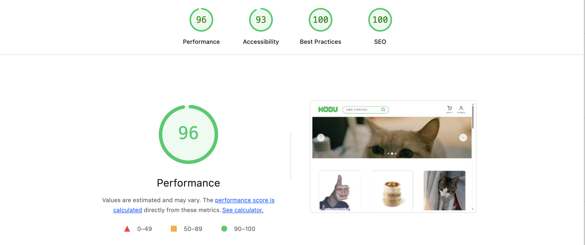
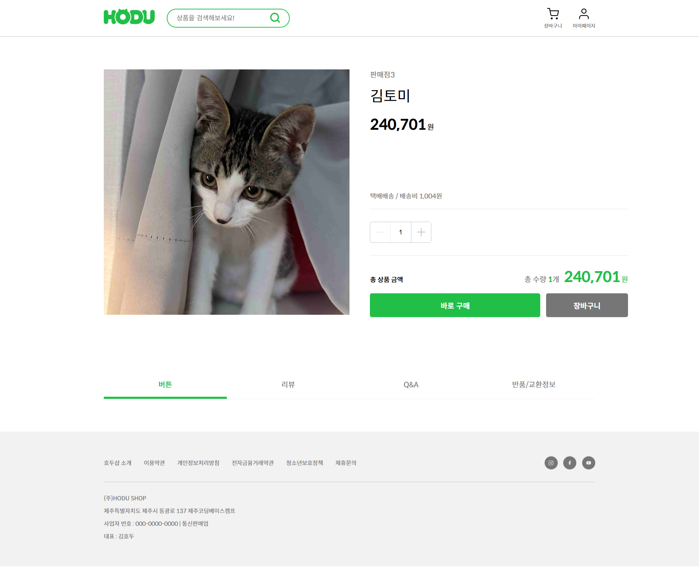
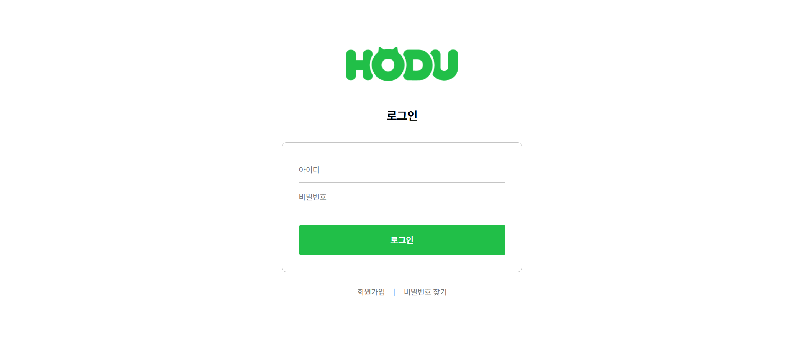
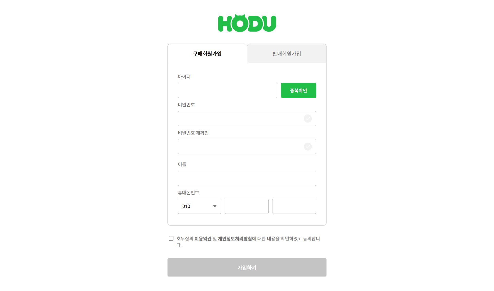
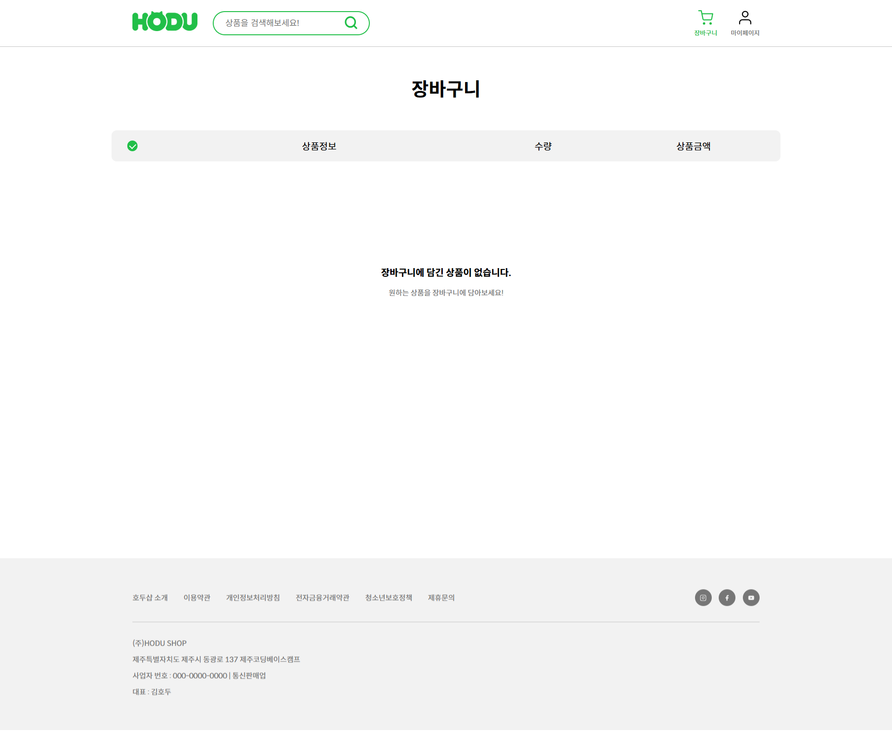
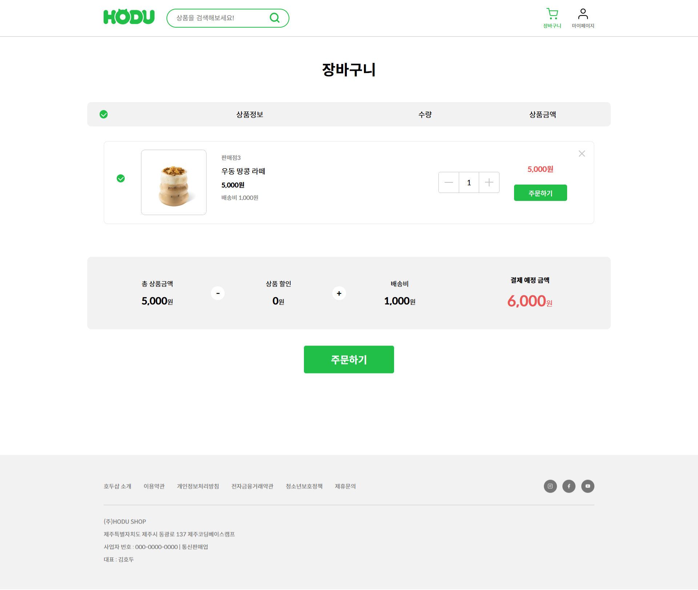
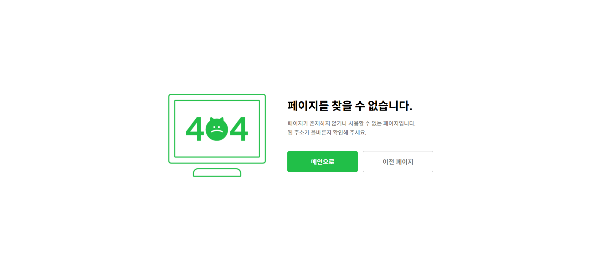

## Table of Contents - 목차

1. [Project Overview - 프로젝트 개요](#1-project-overview---프로젝트-개요)
2. [Tech Stack - 기술 스택](#2-tech-stack---기술-스택)
3. [Project Structure & URLs - 프로젝트 구조 및 URL 설계](#3-project-structure--urls---프로젝트-구조-및-url-설계)
4. [Team Members & Roles - 팀원 및 역할 분담](#4-team-members--roles---팀원-및-역할-분담)
5. [Coding Convention - 코딩 컨벤션](#5-coding-convention---코딩-컨벤션)
6. [Key Features & UX Details - 핵심 기능 및 사용자 경험 상세](#6-key-features--ux-details---핵심-기능-및-사용자-경험-상세)
7. [Collaboration & Work-flow - 협업 프로세스 및 일정](#7-collaboration--work-flow---협업-프로세스-및-일정)
8. [Performance & UI - 성능 지표 및 서비스 화면](#8-performance--ui---성능-지표-및-서비스-화면)
9. [Trouble Shooting - 트러블슈팅 및 문제 해결](#9-trouble-shooting---트러블슈팅-및-문제-해결)
10. [Future Updates - 향후 개발 및 확장 계획](#10-future-updates---향후-개발-및-확장-계획)
11. [Project Review - 회고 및 성찰](#11-project-review---회고-및-성찰)

---

# 팀 오합지졸의 오픈마켓 서비스 프로젝트 (Open Market Service)

## Open Market Service - 오픈마켓 서비스 프로젝트

> **판매자와 구매자를 잇는 커머스 플랫폼** > 본 프로젝트는 Vanilla JS와 REST API를 활용하여 멀티 페이지 애플리케이션(MPA) 환경에서의 상품 등록, 결제 및 CRUD를 직접 구현한 팀 프로젝트입니다.

---

## 프로젝트 개요

- 진행 기간: 2026.01.13 ~ 2026.01.18
- 개발 환경: Vanilla JavaScript, CSS3, HTML5
- 아키텍처: Multi Page Application (MPA)
- 협업 툴: Git, GitHub, (추가: Notion, Figma 등)

### Core Functions - 핵심 구현 기능

- 상품 목록 조회 및 검색
- 상품 상세 정보 확인
- 회원가입 (구매회원)
- 로그인/로그아웃
- 장바구니 추가/수정/삭제
- 404 에러 페이지 처리

---

## Tech Stack - 기술 스택

- **Markup:** HTML5
- **Styling:** CSS3
- **Scripting:** JavaScript (ES6+)
- **HTTP Client:** Fetch API

---

## Project Structure & URLs - 프로젝트 구조 및 URL 설계

프로젝트의 폴더 구조는 기능별로 명확하게 분리하여 관리하고 있습니다. 각 페이지는 독립된 폴더 내의 `index.html`을 가지며, 공통 자원은 `assets` 폴더에서 관리합니다.

### Directory Tree - 디렉토리 구조

```text
root/
├── 404/                # 404 에러 페이지
│   └── index.html
├── assets/             # 정적 자원 관리
│   ├── css/
│   │   ├── pages/      # 페이지별 전용 스타일 (login, join, cart 등)
│   │   ├── common.css  # 공통 레이아웃 스타일
│   │   ├── reset.css   # 브라우저 기본 스타일 초기화
│   │   └── root.css    # CSS 변수 및 루트 설정
│   ├── images/         # 이미지 리소스
│   └── js/
│       ├── common.js   # 공통 로직 및 컴포넌트 연결
│       └── [page].js   # 각 페이지별 독립 스크립트
├── cart/               # 장바구니 페이지
│   └── index.html
├── components/         # 재사용 가능한 HTML 조각
│   ├── footer.html
│   ├── header.html
│   └── login-modal.html
├── join/               # 회원가입 페이지
│   └── index.html
├── login/              # 로그인 페이지
│   └── index.html
├── product-detail/     # 상품 상세 페이지
│   └── index.html
├── index.html          # 메인(상품 목록) 페이지
└── README.md

```

### URL Mapping - URL 경로 매핑

| URL 경로         | 파일 위치                 | 설명             |
| ---------------- | ------------------------- | ---------------- |
| /                | index.html                | 메인 페이지 (홈) |
| /login/          | login/index.html          | 로그인 페이지    |
| /join/           | join/index.html           | 회원가입 페이지  |
| /cart/           | cart/index.html           | 장바구니 페이지  |
| /product-detail/ | product-detail/index.html | 상품 상세 페이지 |
| /404/            | 404/index.html            | 404 에러 페이지  |

---

## Team Members & Roles - 팀원 및 역할 분담

| 이름              |                         GitHub                         | 역할             | 담당 기능 구현                                                                                                       |
| :---------------- | :----------------------------------------------------: | :--------------- | :------------------------------------------------------------------------------------------------------------------- |
| **한유리 (팀장)** | [@circleoflife112](https://github.com/circleoflife112) | 메인 페이지      | 프로젝트 초기 세팅 및 에셋 구조 정리, 프로덕트 페이지 목록 렌더링, 상품 상세페이지와 API 연동, README 작성           |
| **김성민**        |        [@beebeam1](https://github.com/beebeam1)        | 회원가입 페이지  | 구매자 회원가입 유효성 검사, 회원가입·로그인 API 연동 및 인증 처리                                                   |
| **이영미**        |   [@sikyoungj-lab](https://github.com/sikyoungj-lab)   | 로그인 페이지    | 로그인·회원가입 페이지 UI, 로그인 예외 처리(Focus 이벤트)                                                            |
| **변슬기**        |       [@seulgi626](https://github.com/seulgi626)       | 상품 상세 페이지 | 상품 상세 데이터 Fetching, 수량 변경 및 총 가격 계산 로직, 장바구니 중복상품 및 로그인 로직, 헤더 푸터 컴포넌트 연동 |

---

## Coding Convention - 코딩 컨벤션

프로젝트의 유지보수와 원활한 협업을 위해 아래의 컨벤션을 준수하였습니다.

### HTML & CSS

- **HTML:** 모든 태그와 속성은 소문자로 작성하며, 시맨틱 태그(`<header>`, `<main>`, `<footer>` 등) 사용을 지향합니다.
- **Naming:** CSS 클래스명은 `Kebab-case`를 사용합니다. (예: `.card-btn-active`)
- **Property Order:** Layout(display, position) → Box Model(width, margin) → Visual(background, color) → Typography 순으로 작성합니다.
- **Unit:** 반응형을 위해 `rem`, `%`, `vw/vh`를 권장하며, 고정 크기에만 `px`를 사용합니다.

### JavaScript

- **Variable:** `const` 사용을 원칙으로 하며, 변수/함수명은 `camelCase`, 상수는 `UPPER_SNAKE_CASE`를 사용합니다.
- **DOM:** DOM 요소를 담는 변수는 접두어 `$`를 사용합니다. (예: `const $submitBtn`)
- **Syntax:** 화살표 함수와 `async / await` 구문을 사용하며, 모든 문장 끝에는 세미콜론(`;`)을 붙입니다.

---

## Key Features & UX Details - 핵심 기능 및 사용자 경험 상세

### Auth System - 인증 시스템

- **로그인 유효성:** 미입력 시 해당 항목 `focus` 이벤트 발생, 일치하지 않을 시 비밀번호창 초기화 및 `focus`.
- **회원가입:** 모든 입력 및 이용약관 동의 시에만 가입 가능. 아이디 중복 확인 기능 포함.

### Product & Shopping - 상품 및 쇼핑 시스템

- **목록:** API를 통해 실시간 상품 정보(판매자, 상품명, 가격) 노출.
- **상세 정보:** `productId` 기반의 데이터 로드.
- **수량 조절:** 재고 수량 초과 시 `+` 버튼 비활성화 및 수량에 따른 총 가격 실시간 계산.
- **중복 방지:** 이미 선택된 상품의 중복 추가 방지 로직 적용.

### Common Components - 공통 컴포넌트

- **컴포넌트화:** 헤더와 푸터를 별도 JS로 분리하여 관리 및 각 페이지 동적 연결.
- **GNB 유동성:** 비로그인 유저가 장바구니 접근 시 로그인 안내 모달 노출.

---

## Collaboration & Work-flow - 협업 프로세스 및 일정

성공적인 협업과 코드 품질 유지를 위해 GitHub의 다양한 기능을 활용하여 체계적인 워크플로우를 구축하였습니다.

### Work Timeline - 개발 일정 (Gantt Chart)



### GitHub Workflow - 협업 도구 활용

- **GitHub Projects (Kanban):** 전체 할업 업무를 `Todo`, `In Progress`, `Done`으로 세분화하여 실시간 진행 상황을 공유했습니다.
- **Issue-Driven Development:** 모든 기능 구현과 버그 수정은 Issue 등록부터 시작했습니다. 이를 통해 각 작업의 목적을 명확히 하고, 변경 이력을 투명하게 관리했습니다.

### Branch Strategy (Git-Flow)

- **Main Branch:** 배포 가능한 상태의 안정적인 코드만을 관리합니다.
- **Dev Branch:** 기능 구현이 완료된 코드들이 통합되는 개발 주축 브랜치입니다.
- **Feature Branch:** 각 팀원이 담당한 기능을 개발하는 브랜치로, `feat/login`, `feat/join`과 같이 명확한 네이밍 규칙을 적용했습니다.

### Code Review & Pull Request

- **Strict Code Review:** 모든 기능 구현은 `dev` 브랜치로의 Pull Request(PR)를 통해 팀원들의 코드 리뷰를 거쳤습니다.
- **Quality Control:** PR 단계에서 코드 컨벤션 준수 여부 및 로직의 효율성을 검토하고, 팀원 모두의 승인(Approve)이 있을 때만 머지를 진행하여 코드 품질을 상향 평준화했습니다.
- **Conflict Management:** 로컬 환경에서 선제적인 `pull`과 `merge` 테스트를 통해 충돌을 최소화하고 안정적으로 통합했습니다.

---

## Performance & UI - 성능 지표 및 서비스 화면



### Lighthouse Audit - 성능 최적화 지표

|                     코드최적화 이전                     |                    코드 최적화 이후                     |
| :-----------------------------------------------------: | :-----------------------------------------------------: |
|  |  |

**문제점:**

- 이미지 파일 크기가 너무 커서 다운로드 시간이 깁니다.
- 이미지에 `width`와 `height` 속성이 없어 레이아웃 변경(CLS)을 유발합니다.
- 가장 큰 콘텐츠풀 페인트(LCP) 이미지의 로딩이 최적화되어 있지 않습니다.

**해결 방안:**

1.  **이미지 압축:**
    - 메인페이지의 슬라이드 JPG 이미지를 webp로 변경.
2.  **LCP 이미지 최적화:**
    - 가장 중요한 이미지(보통 페이지 상단의 큰 배너 또는 상품 이미지)에 `fetchpriority="high"` 속성을 추가하여 브라우저가 우선적으로 다운로드하도록 유도.
3.  **지연 로딩(Lazy Loading) 적용:**
    - 화면 밖에 있는 이미지(스크롤해야 보이는 이미지)에 `loading="lazy"` 속성을 추가하여 초기 페이지 로드 속도를 개선.

### Page Previews - 페이지별 구성 화면

| 페이지명                        | 스크린샷                                                   | 설명                                                                                                     |
| ------------------------------- | ---------------------------------------------------------- | -------------------------------------------------------------------------------------------------------- |
| **메인 페이지**                 |  | 상품 목록을 그리드 형태로 보여주는 메인 화면입니다. 검색 기능과 장바구니, 마이페이지 접근이 가능합니다.  |
| **상품 상세 페이지**            |  | 개별 상품의 상세 정보를 확인하고 수량을 선택하여 장바구니에 담을 수 있습니다.                            |
| **로그인 페이지**               |     | 아이디와 비밀번호를 입력하여 로그인할 수 있으며, 회원가입 페이지로 이동할 수 있습니다.                   |
| **회원가입 페이지**             |    | 구매회원과 판매회원 중 선택하여 가입할 수 있으며, 아이디 중복확인, 휴대폰번호 입력 등의 기능이 있습니다. |
| **장바구니 페이지 (빈 상태)**   |  | 장바구니에 담긴 상품이 없을 때의 화면입니다.                                                             |
| **장바구니 페이지 (상품 있음)** |  | 장바구니에 담긴 상품을 확인하고 수량 조절, 삭제가 가능하며 총 주문금액을 확인할 수 있습니다.             |
| **404 에러 페이지**             |      | 존재하지 않는 페이지 접근 시 표시되는 에러 페이지입니다.                                                 |

---

## Trouble Shooting - 트러블슈팅 및 문제 해결

| Issue                                                  | Cause                                                                                                                       | Resolution                                                                                                                                                   |
| ------------------------------------------------------ | --------------------------------------------------------------------------------------------------------------------------- | ------------------------------------------------------------------------------------------------------------------------------------------------------------ |
| 배포 환경 내 공통 컴포넌트(Header, Footer) 렌더링 오류 | 로컬 환경과 배포 서버(GitHub Pages 등) 간의 절대/상대 경로 해석 차이로 인해 JS `fetch` 에러 발생                            | `window.location.origin` 및 프로젝트 루트 경로를 동적으로 파악하는 유틸리티 함수를 도입하여 환경에 구애받지 않는 경로 참조 로직으로 개선                     |
| 배포 후 에셋(Icon/Image) 리소스 경로 유실              | 빌드 및 배포 과정에서 디렉토리 구조가 변경되면서 마크업에 하드코딩된 아이콘 경로가 실제 경로와 불일치하여 Broken Image 발생 | 프로젝트 구조 설계에 따라 `assets/images/` 기준의 상대 경로 체계를 전수 조사하여 수정하고, CSS 내 `@import` 및 `url()` 참조 경로를 최적화                    |
| 회원가입 완료 후 로그인 처리 연동 실패                 | 회원가입 API 응답 데이터 처리 로직과 로그인 API 요청 파라미터 간 규격 불일치 또는 비동기 처리 타이밍 문제로 인증 누락 발생  | `async/await` 기반으로 가입 완료 응답을 확인한 후 계정 정보를 전달하는 순차 처리 로직을 보강하고, 가입 완료 즉시 로그인 페이지로 리다이렉트하는 UX 흐름 구축 |

---

## Future Updates - 향후 개발 및 확장 계획

본 프로젝트의 지속적인 고도화를 위해 판매자 전용 기능 및 사용자 편의성 강화를 위한 추가 개발을 계획하고 있습니다.

### Seller-Specific Functions - 판매자 권한 기능 확장

- 인증 및 가입: 판매자 전용 로그인/회원가입 기능을 구현하며, 회원가입 시 10자리 사업자 등록번호 유효성 검사 로직을 추가할 예정입니다.
- 상품 관리 연동: 판매자 센터에서 등록된 상품이 메인 상품 목록에 실시간으로 반영되는 시스템을 구축합니다.
- 판매자 UX: 판매자 계정 접속 시 GNB에서 판매자 센터 접근 버튼을 노출하며, 상세 페이지 내 구매 관련 버튼은 비활성화 처리합니다.

### Advanced Features - 서비스 고도화 사항

- 검색 시스템 강화: GNB 검색창 입력 시 관련 제품명이 나타나는 실시간 리스트 기능 및 검색 결과 페이지 이동 로직을 구현합니다.

---

## Project Review - 회고 및 성찰

- 페이지 간 안정적인 데이터 전달 경험을 쌓았습니다.
- 라이브러리 없이 컴포넌트화와 비동기 처리를 직접 구현하며 동작 원리를 이해했습니다.
- 다양한 예외 상황(중복, 미로그인 등)을 모달로 처리하며 견고한 UX를 설계했습니다.
- Main, Dev, Feature로 분리된 브랜치 전략을 실무에 적용하며 안정적인 코드 통합 프로세스를 경험했습니다.
